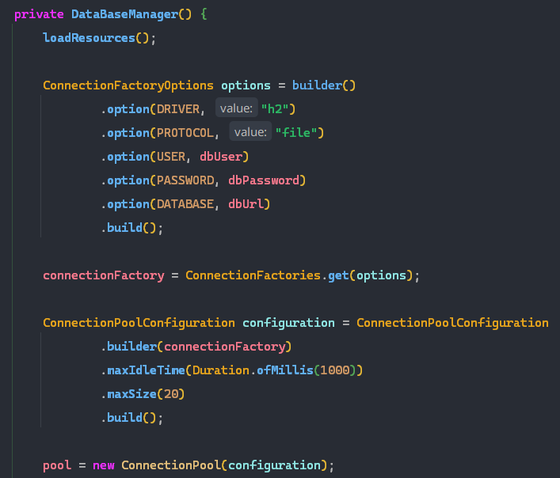
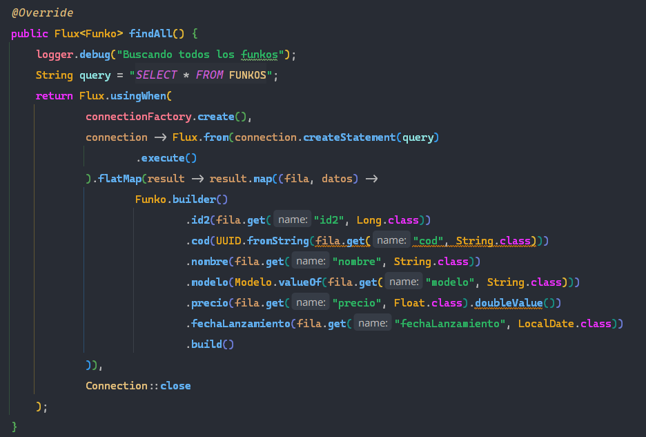
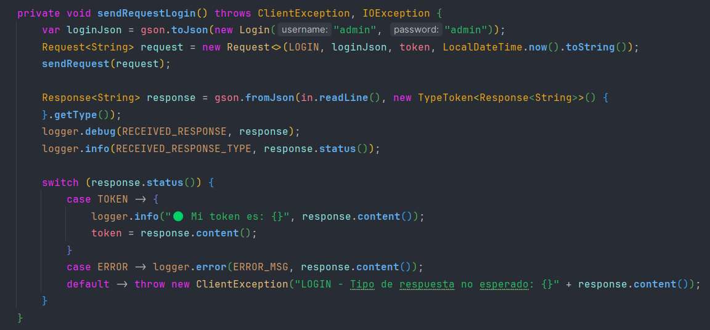
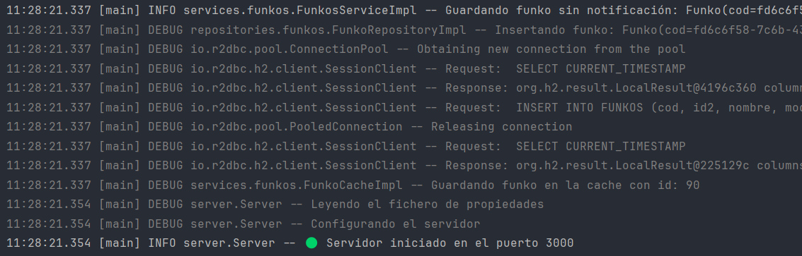
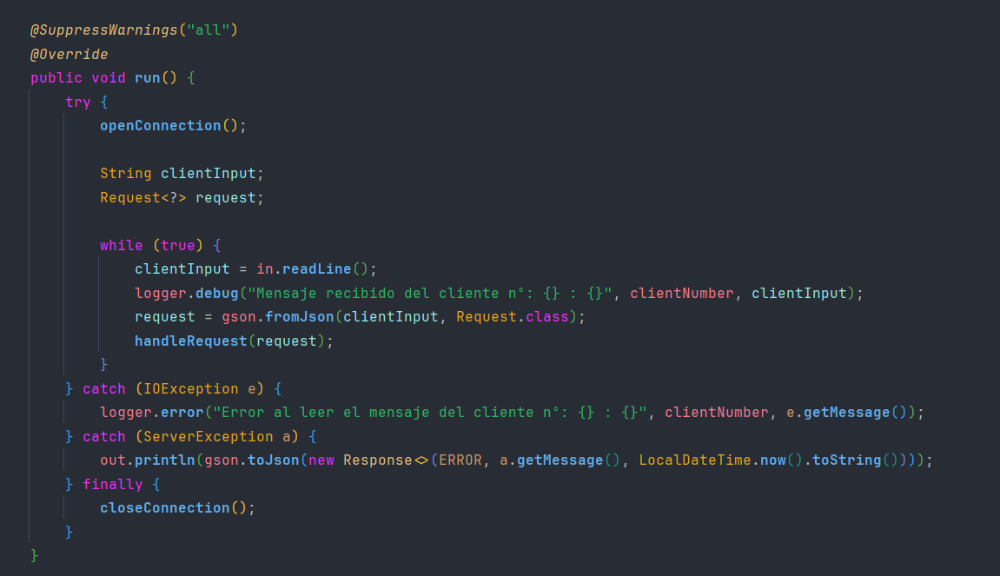
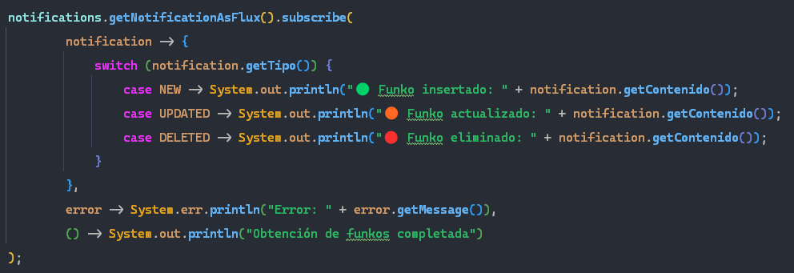
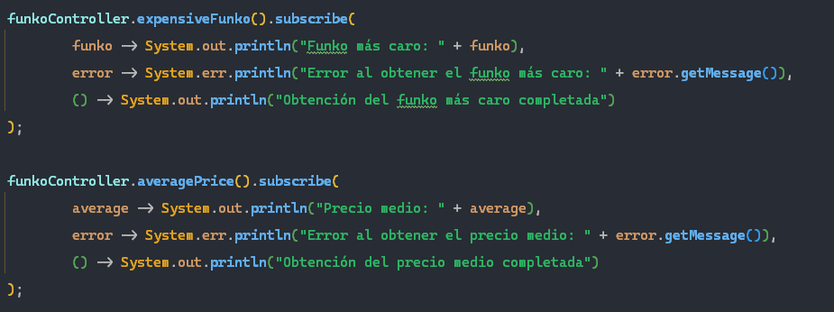

# Funko Server

## Autores

- Jaime Medina
- Eva Gómez Uceda

## Arquitectura seguida en el código.

La arquitectura se ha dividido por partes:
En la carpeta `models` contamos con el apartado de datos, como la clase Funkos , IdGenerator o Notificacion. La parte de lógica se encuentra en las carpetas `repositories` y `services`, en las que contamos con clases como **FunkoRepositoryImpl**,  **FunkoServiceImpl** o **DataBaseManager**. Todas estas se encargan de la parte lógica del programa. Tambien contamos con carpetas como `routes` o `exceptions`, estas contienen las rutas y las excepciones usadas en el programa. En **FunkoStorage** tenemos los métodos correspondientes para importar desde CSV y exportar a JSON. Por último tenemos **FunkoController** que llama a los métodos de FunkoService.

## DataBase

En la clase DataBaseManager usamos el driver **R2DBC** para conectarnos a la base de datos H2. Para ello usamos **ConnectionFactory**, **ConnectionFactoryOptions** en el que establecemos las opciones de conexión y **ConnectionPoolConfiguration**. Todo esto lo usamos de la siguiente forma:

También tenemos el método loadResources que se encarga de leer del fichero de propiedades database.properties la URL, el
usuario, la contraseña y si debemos o no de iniciarlizar las tablas. Para esto haremos uso del método startTables que
llamará al método `executeScripts` y este ejecutará las sentencias SQL de los ficheros *delete.sql* e *init.sql*.

## FunkosService

Esta clase implementa la interfaz FunkosService, que contiene los siguientes métodos:

- `findAll()`: Devuelve una secuencia de Funkos a través de un flujo (Flux).
- `findByNombre(String nombre)`: Busca Funkos por nombre y devuelve un flujo. Si no se encuentra ninguno, lanza una
  excepción `FunkoNotFoundException`.
- `findById(long id)`: Busca un Funko por su ID y devuelve un Mono. Si no se encuentra, lanza una
  excepción `FunkoNotFoundException`.
- `save(Funko funko)`: Guarda un Funko en el repositorio y notifica una nueva notificación de tipo "NEW".
- `update(Funko funko)`: Actualiza un Funko en el repositorio y notifica una notificación de tipo "UPDATED".
- `deleteById(long id)`: Elimina un Funko por su ID en el repositorio y notifica una notificación de tipo "DELETED".
- `deleteAll()`: Elimina todos los Funkos en el repositorio y borra la caché.
- `exportToJson()`: Llama al método `exportToJson` de la clase **FunkoStorage**

  - `importFromCsv()`: Llama al método `loadCsv` de la clase **FunkoStorage**.
    Todos estos métodos llaman llaman a los métodos de **FunkoRepository** e implementan notificaciones, esto se hace
    gracias a la clase **FunkosNotifications** y su método notify.

## FunkosNotifications

**Clase: FunkosNotificationsImpl**

La clase `FunkosNotificationsImpl` es una implementación de la interfaz `FunkosNotifications`, diseñada para gestionarnotificaciones relacionadas con Funkos. Estos son sus métodos:

- `getInstance()`: Proporciona una instancia única de `FunkosNotificationsImpl` para garantizar la singularidad de la
  notificación.
- `getNotificationAsFlux()`: Devuelve un flujo (Flux) de notificaciones de Funkos, permitiendo a otros componentes
  suscribirse y recibir notificaciones.
- `notify(Notificacion<Funko> notificacion)`: Permite enviar notificaciones de Funkos a través del flujo, que serán
  recibidas por los suscriptores.

Esta clase se encarga de la gestión de notificaciones relacionadas con Funkos, ofreciendo una forma de suscribirse y
recibir notificaciones a medida que ocurren.

## FunkoRepository

La clase `FunkoRepositoryImpl` implementa la interfaz `FunkoRepository` que a su vez implementa lainterfaz `CrudRepository`. Se encarga de interactuar con una base de datos para realizar operaciones CRUD relacionadascon los Funkos. Estos son sus métodos

- `save(Funko funko)`: Inserta un Funko en la base de datos y devuelve un Mono con el Funko insertado.
- `update(Funko funko)`: Actualiza un Funko en la base de datos y devuelve un Mono con el Funko actualizado.
- `findById(Long id)`: Busca un Funko por su ID en la base de datos y devuelve un Mono con el Funko encontrado.
- `findAll()`: Busca y devuelve todos los Funkos en la base de datos como un flujo (Flux).
- `deleteById(Long idDelete)`: Borra un Funko por su ID en la base de datos y devuelve un Mono booleano que indica si se
  realizó la eliminación con éxito.
- `deleteAll()`: Borra todos los Funkos en la base de datos y devuelve un Mono vacío.
- `findByNombre(String nombre)`: Busca Funkos por nombre en la base de datos y los devuelve como un flujo (Flux).
- `exportJson(String ruta)`: Exporta los Funkos a un archivo JSON en la ruta especificada.

La forma de obtener datos de la Base de Datos es sencilla, vamos a explicar el método findAll.
El método devuelve un Flux de Funkos, para ello usamos Flux.usingWhen que garantiza la apertura y cerrado de conexión
correctos, abrimos la conexión con connectionFactory.create() y ejecutamos la query con connection.createStatement(
*Sentencia SQL*). Después, con flatMap procesamos los datos que nos devuelve la base de datos y creamos funkos con el
patrón builder. Al acabar cerramos la conexión con Connection::close

## FunkoController

La clase `FunkoController` se encarga cargar los Funkos desde el CSV y de realizar operaciones de búsqueda.

- **Entrada de datos**:
  - `loadCsv()`: lee el CSV y crea objetos Funko para agregarlos a una Lista, para ello utiliza el método `loadCsv()`.
- **Métodos de obtención de datos**:Para obtener los datos utilizamos los métodos de stream, como por ejemplo filter o collect.
  - `expensiveFunko()`: Devuelve el Funko más caro en la colección.
  - `averagePrice()`: Calcula el precio promedio de los Funkos en la colección.
  - `groupByModelo()`: Agrupa los Funkos por modelo.
  - `funkosByModelo()`: Cuenta la cantidad de Funkos por modelo.
  - `funkosIn2023()`: Filtra los Funkos lanzados en el año 2023.
  - `numberStitch()`: Cuenta la cantidad de Funkos cuyo nombre contiene "Stitch".
  - `funkoStitch()`: Filtra y devuelve los Funkos cuyo nombre contiene "Stitch".

## Client

Con esta clase interactuamos con un servidor a través de una conexión segura SSL para enviar y recibir solicitudes sobre Funkos, para ello tenemos los siguientes métodos:

- `start()`: Utilizamos este método como punto de inicio para abrir la conexión, enviar solicitudes al servidor y cerrar la conexión al finalizar.
- `openConnection()`: Se encarga de establecer la conexión segura SSL con el servidor.
- `closeConnection()`: Se utiliza para cerrar de manera ordenada la conexión SSL.
- `sendRequestLogin`: Envía una solicitud de inicio de sesión al servidor.
- `sendRequestDelete`: Envía una solicitud de eliminación de un Funko.
- `sendRequestGetAll`: Obtiene una lista de todos los Funkos.
- `sendRequestGetByCode`: Obtiene un Funko por su código.
- `sendRequestGetByModelo`: Obtiene Funkos por modelo.
- `sendRequestGetByRelease`: Obtiene Funkos por fecha de lanzamiento.
- `sendRequestPost`: Crea un nuevo Funko en el servidor.
- `sendRequestPut`: Actualiza un Funko existente en el servidor.
- `sendRequestSalir`: Envía una solicitud de salida para terminar salir.

Explicaremos por ejemplo el funcionamiento de `sendRequestLogin()`, primero serializamos un objeto de inicio de sesión en formato JSON utilizando la biblioteca Gson, con esto conseguimos que el servidor puede entender y procesar los datos que le enviamos, después creamos la solicitud, en este caso de tipo `LOGIN`, le enviamos la solicitud al servidor usando el método **sendRequest(request)** y evaluamos el estado de la respuesta del servidor, depende de cual sea realizaremos una acción u otra.

## Server

El servidor utiliza un archivo de propiedades `server.properties` con las siguientes claves:

- `keyFile`: Ruta al archivo.
- `keyPassword`: Contraseña del archivo.
- `tokenSecret`: Secreto para la generación de tokens de seguridad.
- `tokenExpiration`: Duración de validez de los tokens.

Utilizamos el servidor para enviar respuestas al cliente según sus solicitudes, en esta clase tenemos los siguientes métodos:

- `readEnv()`: Lee la configuración del servidor desde un archivo de propiedades llamado *server.properties*.
- `configureServer()`: Configura el sistema para utilizar un almacén de claves y su contraseña para habilitar conexiones seguras en el servidor.
- ` startServer()`: Inicializa el servidor.
- `runServer()`: Se encarga de aceptar conexiones de clientes entrantes y maneja las conexiones.
- `createServerSocket()`: Crea un objeto **SSLServerSocket**  para escuchar conexiones seguras a través del protocolo SSL/TLS en un puerto específico (*PUERTO*).

Al iniciar esta clase, veremos como inicia conexión con la base de datos, importa los datos desde el archivo CSV, y finalmente nos muestra la notificación de inicialización.

## ClientHandler

La clase `ClientHandler` gestiona las conexiones entrantes de los clientes y procesa las solicitudes enviadas por los mismos y genera las respuestas correspondientes, además gestiona la seguridad gracias a los tokens de acceso. Todo esto se consigue a través de los siguientes métodos:

- `openConnection()`: Abre una conexión con el cliente, estableciendo el **BufferedReader** y el **PrintWriter** para la comunicación.
- `closeConnection()`: Cierra la conexión con el cliente.
- `run()`: Inicializa el `ClientHandler` escuchando y procesando las solicitudes del cliente en un bucle infinito.
- `handleRequest(Request<?> request)`: Procesa una solicitud recibida del cliente y en función de su tipo la gestiona de una manera u otra.
- Métodos específicos para procesar distintos tipos de solicitudes, como `processLogin`, `processGetAll`, `processGetByCode`,`processGetByModelo`, `processGetByReleaseDate`, `processPost`, `processPut`, `processDelete` y `processExit`.

Las operaciones como la eliminación de registros, requieren que el cliente tenga un rol de administrador para ser ejecutadas.

## Ejecución

En la clase Main primero instanciamos todos los objetos llamando a sus métodos getInstance(). Posteriormente llamamos al método `getNotificationAsFlux` de **FunkosNotificationImpl** y nos subscribimos, de esta forma iniciamos el servicio de
notificaciones lo primero y ahora nos irán saltando a medidas que recibamos notificaciones. Dependiendo del tipo de notificación (NEW, UPDATED, DELETED) imprimiremos un mensaje distinto, y en caso de error lo mostraremos con
System.err.println.

Después llamamos al método loadCsv de la clase FunkoController para que lea los funkos del csv y los cargue en memoria. Posteriormente llamaremos a los métodos de obtención de datos como expensiveFunko y nos subscribiremos.

Para introducir los datos en la base de datos usaremos el método save de **FunkosService** y lo haremos dentro de un bucle for-each. Después ya podemos llamar a los métodos de esta clase como `findById` o `findByNombre` y subscribirnos.
Para terminar exportaremos los funkos a un Json con exportJson y le pasaremos por parámetro la ruta con la clase **Routes**.
Para finalizar el programa usaremos *System.exit(0)* que provocará la salida inmediata.
